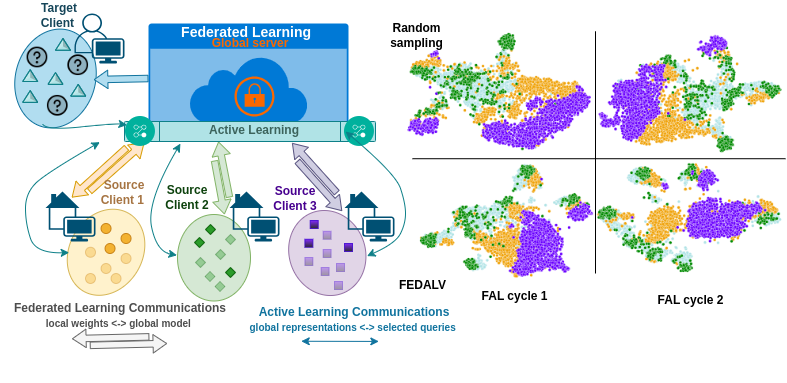

# FEDALV
### Federated Active Learning for Domain Generalisation

This is the official code release for FEDALV.

Paper: [https://arxiv.org/pdf/2312.02247.pdf](https://arxiv.org/pdf/2312.02247.pdf)

Datasets used: 
* [PACS](https://domaingeneralization.github.io/#data) 
* [OfficeHome](https://www.hemanthdv.org/officeHomeDataset.html)
* [OfficeCaltech](https://github.com/ZhangJUJU/OfficeCaltechDomainAdaptation)

## FEDALV Pipeline


Active Learning is integrated at the server level in our proposed Federated Domain Generalisation framework. Initially, a subset of source data is labelled, and over time, it is refined to retain only the most informative samples for target generalisation. Communication links with the global model operate during the Federated Learning training, and Active Learning queries are propagated once the process is complete. After just a couple of cycles, the target domain (light blue) aligns with the sources in class clusters.

## Deployment 
We recommend to create a python3 environment and install the requirements.txt file
```Shell
pip install -r requirements.txt
```
## Run

## Contact Info
Razvan Caramalau: [r.caramalau@ucl.ac.uk](r.caramalau@ucl.ac.uk)

## Acknowledgement
  

This work was supported in whole, or in part, by the Wellcome/EPSRC Centre for Interventional and Surgical Sciences (WEISS) [203145/Z/16/Z], the Department of Science, Innovation and Technology (DSIT) and the Royal Academy of Engineering under the Chair in Emerging Technologies programme; Horizon 2020 FET Open (EndoMapper) (12/2019 – 11/2024) [863146].
Not for commercial use. Also, thankful to the following repos:
## Citation
Caramalau, R., Bhattarai, B., and Stoyanov, D., “Federated Active Learning for Target Domain Generalisation”, <i>arXiv e-prints</i>, 2023. https://doi.org/10.48550/arXiv.2312.02247 
## BibTeX
```
@misc{caramalau2023federated,
      title={Federated Active Learning for Target Domain Generalisation}, 
      author={Razvan Caramalau and Binod Bhattarai and Danail Stoyanov},
      year={2023},
      eprint={2312.02247},
      archivePrefix={arXiv},
      primaryClass={cs.LG}
}
```
